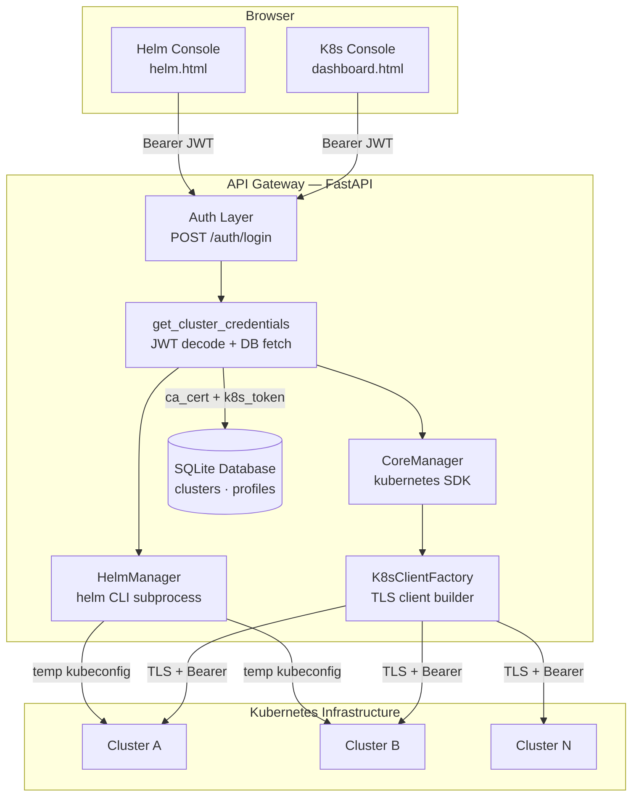
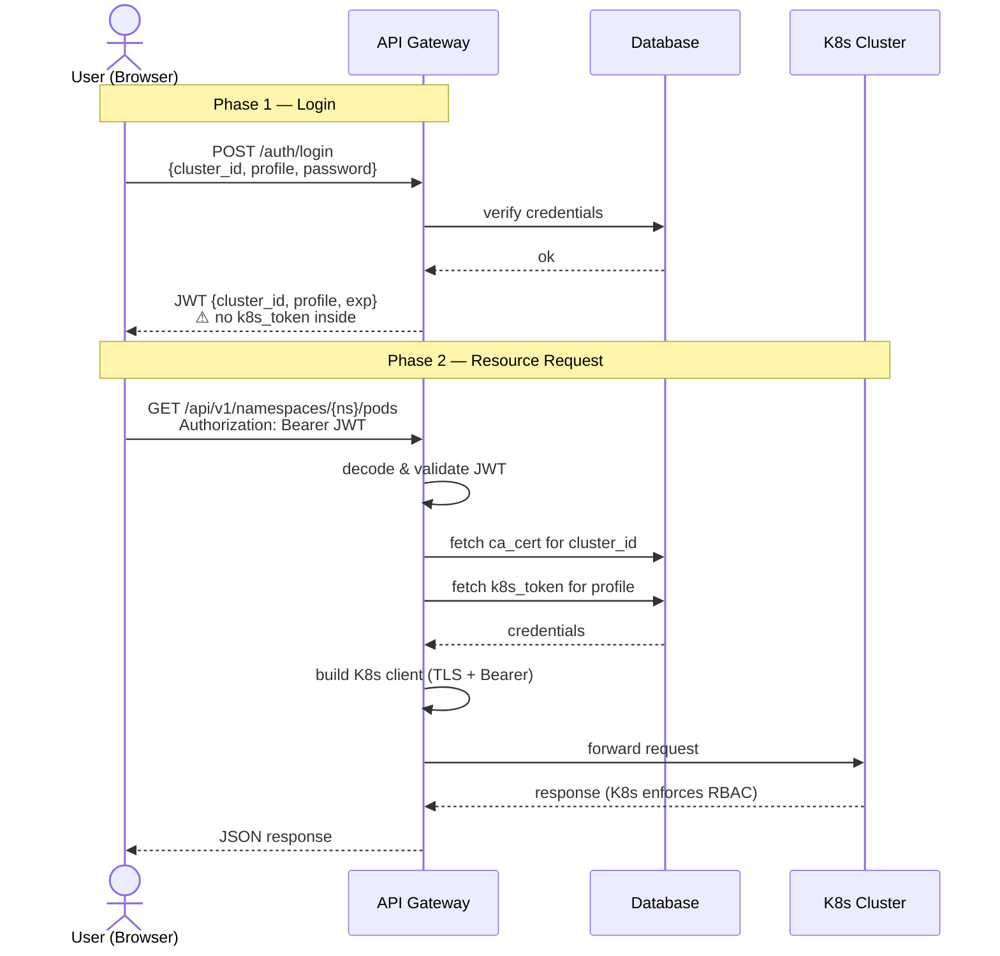
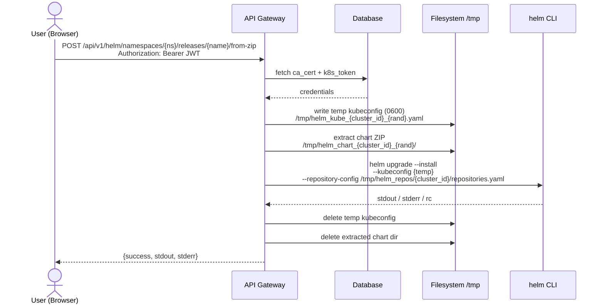

# Integrated Framework for Multi-Cluster Kubernetes Governance: Secure Helm Distribution and RBAC-driven Orchestration.

> A zero-knowledge, multi-tenant Kubernetes management platform. Credentials never leave the server — users get access, not keys.

[](https://python.org)
[](https://fastapi.tiangolo.com)
[](https://docker.com)
[](https://helm.sh)

---

## What is this platform?

This gateway is a self-hosted web platform that acts as an authenticated proxy between your users and your Kubernetes clusters. Instead of distributing `kubeconfig` files or Service Account tokens, the platform issues short-lived JWTs that contain **no Kubernetes credentials**. Every real credential — SA token, CA certificate — lives exclusively in the server-side database and is injected per-request, invisible to the client.

The result is a team-friendly control plane where access is managed through profiles, revocation is instant, and the blast radius of a stolen JWT is limited to what the gateway exposes — not direct cluster access.

**Two integrated consoles:**

- **K8s Console** — real-time visibility and operations: namespaces, pods, deployments, services, ingresses, RBAC, storage, events.
- **Helm Console** — application lifecycle management: install charts from repositories or ZIP uploads, inspect history, rollback, lint before deploying.

---

## Core Design Principles

**Zero-knowledge client side.** The browser JWT contains only `cluster_id` and `profile`. The Kubernetes SA token and CA certificate are fetched server-side from the database on every authenticated request and discarded after use.

**Stateless architecture.** The gateway holds no session state. Each request is fully self-contained: verify JWT → fetch credentials from DB → build scoped K8s client → forward request → discard client.

**K8s enforces authorization.** The gateway delegates all resource-level access control to Kubernetes RBAC. A restricted Service Account will receive `403` from the cluster; the gateway propagates it to the frontend. No shadow permission system.

**Profile-based multi-tenancy.** Each cluster supports multiple profiles (e.g. `admin`, `dev`, `ci`), each mapping to a different Service Account. A user authenticates against a profile, not against the cluster directly.

**Per-cluster Helm isolation.** Each cluster maintains its own Helm repository configuration and cache, invisible to users of other clusters.

---

## High-Level Architecture



---

## Authentication Flow



**JWT payload contains:** `cluster_id`, `cluster_host`, `profile`, `jti`, `exp`
**JWT payload never contains:** `k8s_token`, `ca_cert`, `password`

---

## Helm Request Flow



---

## Admin API

Cluster and profile management is protected by a master key sent in the `master-key` HTTP header. This API is intended for platform administrators only and is not exposed through the frontend.

```
Base path: /api/v1/admin
Header:    master-key: <ADMIN_MASTER_KEY>
```

### Clusters

| Method | Path | Description |
|---|---|---|
| `GET` | `/clusters` | List all registered clusters |
| `POST` | `/clusters` | Register a new cluster (`multipart/form-data`: `id`, `name`, `host`, `ca_file`) |
| `PATCH` | `/clusters/{cluster_id}` | Update cluster name, host, or CA certificate |
| `DELETE` | `/clusters/{cluster_id}` | Remove cluster and all associated profiles |

### Profiles

| Method | Path | Description |
|---|---|---|
| `GET` | `/profiles` | List all profiles (token preview only, never full token) |
| `POST` | `/profiles` | Create a profile (`JSON`: `cluster_id`, `name`, `gateway_password`, `k8s_token`) |
| `PATCH` | `/profiles/{profile_id}` | Update password or SA token |
| `DELETE` | `/profiles/{profile_id}` | Remove a profile |

**Register a cluster (example):**

```bash
curl -X POST http://localhost:8000/api/v1/admin/clusters \
  -H "master-key: your-admin-key" \
  -F "id=MY-CLUSTER" \
  -F "name=Production K3s" \
  -F "host=https://10.0.0.1:6443" \
  -F "ca_file=@/path/to/ca.crt"
```

**Register a profile (example):**

```bash
curl -X POST http://localhost:8000/api/v1/admin/profiles \
  -H "master-key: your-admin-key" \
  -H "Content-Type: application/json" \
  -d '{
    "cluster_id": "MY-CLUSTER",
    "name": "dev",
    "gateway_password": "dev-password",
    "k8s_token": "eyJhbGci..."
  }'
```

---

## Project Structure

```
k8s-cloud-gateway/
│
├── docker-compose.yml
├── .env
│
├── backend/
│   ├── Dockerfile
│   ├── requirements.txt
│   └── app/
│       ├── main.py
│       ├── api/
│       │   ├── auth/
|       |   |   ├── auth_routes.py
│       │   │   └── auth_handler.py          # JWT issue & decode
│       │   ├── dependencies/
│       │   │   ├── get_cluster_credentials.py   # shared: JWT + DB → ClusterCredentials
│       │   │   ├── get_core_manager.py           # builds CoreManager
│       │   │   └── get_helm_manager.py           # builds HelmManager + kubeconfig lifecycle
│       │   ├── routes/
│       │   |   ├── k8s_routes.py            # K8s resource endpoints
│       │   |   ├── helm_routes.py           # Helm endpoints
│       │   |   ├── admin_routes.py          # Cluster & profile management
│       │   |   └── audit_routes.py          # Compliance audit endpoints
|       |   |__ api_server.py                # API init and settings
|       |
│       ├── core/
│       │   ├── core_manager.py              # K8s operations
│       │   ├── helm_manager.py              # Helm operations
│       │   ├── audit_engine.py              # Compliance rule engine
│       │   ├── fleet_manager.py             # Background fleet observer + cache
|       |   ├── registry.py
│       │   └── exceptions.py
│       └── infrastructure/
│           ├── k8s_factory.py               # Authenticated K8s client builder
│           ├── helm_kubeconfig.py           # Temp kubeconfig context manager
│           ├── cluster_scanner.py           # Parallel cluster health scan
│           ├── encryption.py               # Fernet key management
│           └── database.py                 # SQLAlchemy models + SessionLocal
│
├── frontend/
│   ├── index.html                           # Login
│   ├── dashboard.html                       # K8s Console
│   ├── helm.html                            # Helm Console
│   ├── admin.html                           # Admin Console
│   └── assets/
│       ├── css/style.css
│       └── js/
│           ├── api.js                       # apiCall(), JWT handling, error dispatch
│           ├── ui.js                        # Shared UI helpers
│           └── modules/
│               ├── cluster.js
│               ├── workloads.js
│               ├── network_config.js
│               ├── rbac.js
│               └── helm.js
│
└── data/
    └── gateway.db                           # SQLite (auto-created on first run)
```

---

## Deployment

### Prerequisites

- Docker and Docker Compose
- One or more Kubernetes clusters with Service Accounts and their tokens
- The CA certificate of each cluster (PEM format)
- Network connectivity from the gateway container to each cluster's API server (port 6443)

### Quick Start

```bash
# 1. Clone the repository
git clone https://github.com/AndreaProzzo21/k8s-cloud-gateway.git
cd k8s-cloud-gateway

# 2. Configure environment
cp .env.example .env
# Fill in JWT_SECRET_KEY, ADMIN_MASTER_KEY and ENCRYPTION_KEY (see below)

# 3. Build and start the stack
docker compose up --build -d

# 4. Register a cluster and a profile (see Admin API section above)

# 5. Open the dashboard
open http://localhost:80
```

### Architecture: Nginx as Reverse Proxy

The frontend container (Nginx) serves two roles: static file server and reverse proxy. All API calls from the browser go to `http://localhost/api/v1/...` — Nginx forwards them to the backend container on the internal Docker network. **Port 8000 is not exposed to the host.**

```
Browser → :80 (Nginx)
              ├── /api/*    → proxy_pass → backend:8000  (internal network only)
              └── /*        → serve static files
```

This means the backend API is never directly reachable from outside the container network, and the browser only ever talks to a single origin — no CORS issues, no exposed internal ports.

### Environment Variables

```dotenv
# Port through which the FastAPI backend is exposed (default: 8000, internal only)
GATEWAY_PORT=8000

# JWT signing key — use a long random string, keep it secret
JWT_SECRET_KEY=
# Generate with: python -c "import secrets; print(secrets.token_hex(32))"

# JWT signing algorithm and expiry in hours
JWT_SECRET_ALGORITHM=HS256
JWT_EXPIRE_HOURS=1

# Master key for the admin API — protect this carefully
ADMIN_MASTER_KEY=
# Generate with: python -c "import secrets; print(secrets.token_hex(32))"

# SQLite database path (relative to /app inside the container)
DATABASE_URL=data/gateway.db

# Fernet encryption key for sensitive DB fields (k8s_token, gateway_password, ca_cert)
ENCRYPTION_KEY=
# Generate with: python -c "from cryptography.fernet import Fernet; print(Fernet.generate_key().decode())"
```

### Docker Compose (development / build)

Used to build the images locally. The `tester` service runs the test suite and is excluded from normal `up`.

```yaml
services:
  backend:
    build:
      context: ./backend
      dockerfile: Dockerfile
      target: prod
    image: aprozzo/k8s-gateway-backend:1.0.0
    container_name: k8s_api_gateway_v1
    expose:
      - "8000"          # internal only — not reachable from the host
    env_file:
      - .env
    volumes:
      - ./data:/app/data
      - helm_repos:/tmp/helm_repos
    networks:
      - k8s_network
    restart: always

  frontend:
    build:
      context: ./frontend
      dockerfile: Dockerfile
    image: aprozzo/k8s-gateway-frontend:1.0.0
    container_name: k8s_frontend_v1
    ports:
      - "80:80"         # single entry point: UI + API proxy
    networks:
      - k8s_network
    restart: always
    depends_on:
      - backend

  tester:
    build:
      context: ./backend
      dockerfile: Dockerfile
      target: test
    networks:
      - k8s_network
    env_file:
      - .env
    profiles: ["test"]  # excluded from normal 'docker compose up'

networks:
  k8s_network:
    driver: bridge

volumes:
  helm_repos:
```

> **Why only one volume?** Helm repository configuration lives under `/tmp/helm_repos/{cluster_id}/` — managed by `HelmManager` and passed to the `helm` binary via `--repository-config` and `--repository-cache`. One named volume persists all per-cluster repo state across restarts.

---

## Security Notes

| Topic | Current state | Roadmap |
|---|---|---|
| JWT storage | `localStorage` | Migrate to `HttpOnly` cookies |
| DB credentials at rest | Fernet-encrypted (k8s_token, gateway_password, ca_cert) | ✅ Done |
| Authorization | Delegated to K8s RBAC | Optional namespace allowlist per profile |
| Backend port exposure | Internal only — not reachable from host | ✅ Done |
| Helm kubeconfig | Temp file `0600`, deleted after request | ✅ Done |
| CA certificate | Written to `/tmp` once per cluster, cached | ✅ Done |
| Admin API | Protected by master key header | Consider IP allowlist in production |

---

### API Documentation

The framework provides two ways to explore and test the available endpoints:

* **Official Developer Portal (Static)**:
For a deep dive into the architecture, governance principles, and detailed API schemas, visit our **[Online Documentation](https://andreaprozzo21.github.io/k8s-cloud-gateway/)**. This version is always available and powered by Redoc.
* **Interactive Swagger UI (Live)**:
When the gateway is running locally, you can access the interactive documentation at:
[`http://localhost:8000/docs`](https://www.google.com/search?q=http://localhost:8000/docs)

---

## Roadmap

- [ ] `HttpOnly` cookie-based JWT storage to mitigate XSS
- [ ] Namespace allowlist per profile (enforced server-side before reaching K8s)
- [ ] WebSocket streaming for real-time pod logs
- [ ] Multi-user audit log
- [ ] OCI registry support for Helm chart distribution
- [ ] Helm dependency resolution (`helm dependency update`) before ZIP deploy
- [x] Fernet encryption for sensitive database columns
- [x] Nginx reverse proxy — backend port no longer exposed to host
- [x] Fleet observer with compliance audit engine