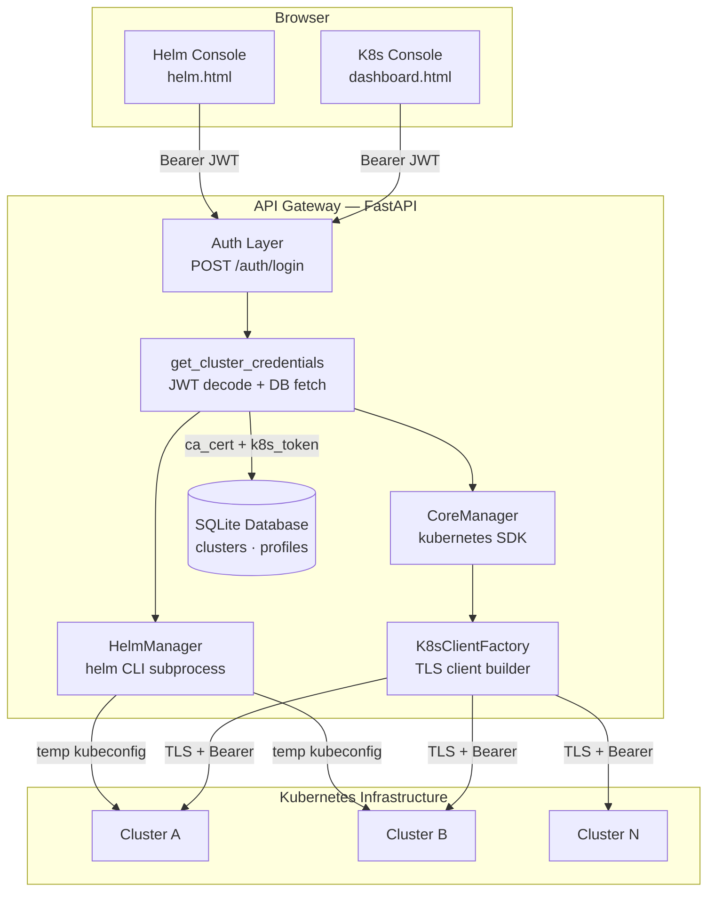
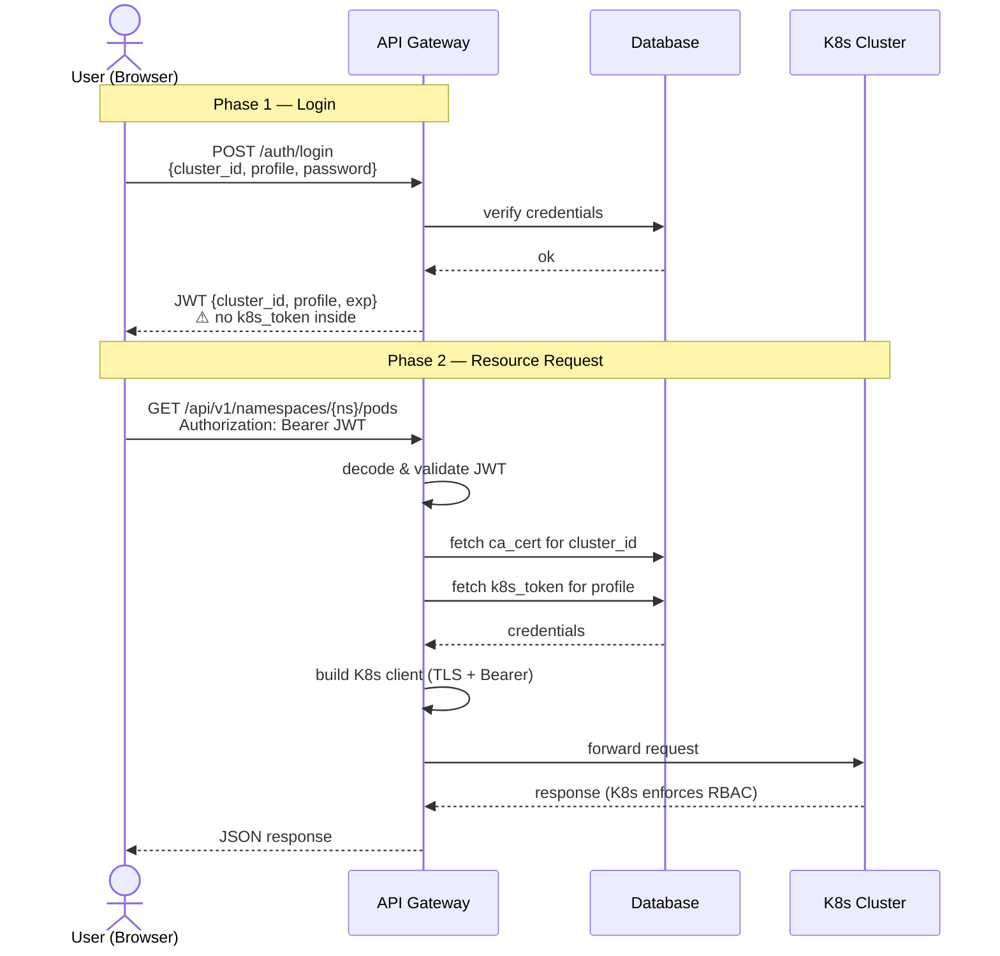
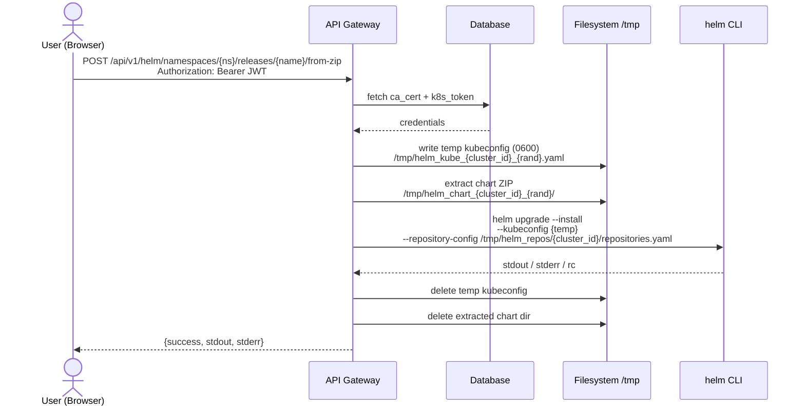

# Kubernetes Multi-Cluster Access Gateway

> A zero-knowledge, multi-tenant Kubernetes management platform. Credentials never leave the server — users get access, not keys.

[](https://python.org)
[](https://fastapi.tiangolo.com)
[](https://docker.com)
[](https://kubernetes.io)
[](https://helm.sh)

---

## What is this platform?

This gateway is a self-hosted web platform that acts as an authenticated proxy between your users and your Kubernetes clusters. Instead of distributing `kubeconfig` files or Service Account tokens, the platform issues short-lived JWTs that contain **no Kubernetes credentials**. Every real credential — SA token, CA certificate — lives exclusively in the server-side database and is injected per-request, invisible to the client.

The result is a team-friendly control plane where access is managed through profiles, revocation is instant, and the blast radius of a stolen JWT is limited to what the gateway exposes — not direct cluster access.

### Who is it for?

- **DevOps Teams**: Manage access to multiple clusters (Prod, Staging, Dev) behind a protected VPN without sharing sensitive config files.
- **K8s Enthusiasts**: An easy, lightweight web interface to monitor and manage home labs or personal clusters without the complexity of heavy enterprise tools.
- **Edge & Digital Twin Developers**: Ideal for industrial contexts where you need to deploy "Digital Twins" or specific workloads to Edge nodes located near a factory. Just upload your Helm package via the ZIP feature to distribute applications globally with one click.

**Two integrated consoles:**

- **K8s Console** — real-time visibility and operations: namespaces, pods, deployments, services, ingresses, RBAC, storage, events.
- **Helm Console** — application lifecycle management: install charts from repositories or ZIP uploads, inspect history, rollback, lint before deploying.

---

## Core Design Principles

**Zero-knowledge client side.** The browser JWT contains only `cluster_id` and `profile`. The Kubernetes SA token and CA certificate are fetched server-side from the database on every authenticated request and discarded after use.

**Stateless architecture.** The gateway holds no session state. Each request is fully self-contained: verify JWT → fetch credentials from DB → build scoped K8s client → forward request → discard client.

**K8s enforces authorization.** The gateway delegates all resource-level access control to Kubernetes RBAC. A restricted Service Account will receive `403` from the cluster; the gateway propagates it to the frontend. No shadow permission system.

**Profile-based multi-tenancy.** Each cluster supports multiple profiles (e.g. `admin`, `dev`, `ci`), each mapping to a different Service Account. A user authenticates against a profile, not against the cluster directly.

**Per-cluster Helm isolation.** Each cluster maintains its own Helm repository configuration and cache, invisible to users of other clusters.

---

### Granular Access Control & RBAC

The Gateway is designed to be a transparent proxy for Kubernetes RBAC. This means you have **absolute freedom** in defining the power of each Profile.

* **Full Admin Access**: Use a `cluster-admin` Service Account to manage the entire fleet, monitor nodes, and handle global configurations.
* **Namespace-Restricted**: Create a Service Account limited to a single namespace (e.g., `development`). The user will be able to see and manage only that namespace; any attempt to access other resources will be blocked by Kubernetes and reported as `403 Unauthorized` by the Gateway.
* **Read-Only Auditor**: Provide a token with only `get` and `list` permissions. The UI will automatically prevent or fail any "Write" operations (like scaling or deleting pods).

**The Gateway ensures that:**

1. **Backend Integrity**: Every request is signed server-side with the specific token of the profile. There is no way for a user to "escalate" privileges within the Gateway.
2. **Frontend Consistency**: The UI propagates Kubernetes errors. If a Service Account cannot list Pods, the dashboard will gracefully show an unauthorized message, keeping the system secure and consistent with your cluster's security posture.

### Pro-Tip: The "Admin" Convention

While you can create profiles with **any permissions**, the background **Fleet Observer** (Global Health) specifically looks for a profile named `admin`, `gateway-admin`, or `cluster-admin` to collect infrastructure metrics.
*To get the most out of the Admin Console, ensure at least one profile with these names has `cluster-reader` or `cluster-admin` privileges.*

---

## High-Level Architecture



---

## Authentication Flow



**JWT payload contains:** `cluster_id`, `cluster_host`, `profile`, `jti`, `exp`
**JWT payload never contains:** `k8s_token`, `ca_cert`, `password`

---

## Helm Request Flow


---

## Admin Console & API

The platform infrastructure is managed through a **dedicated Admin Console** accessible at `http://localhost/admin.html`.

- **Authentication**: Requires the `ADMIN_MASTER_KEY` defined in your `.env` file, sent as the `X-Admin-Key` HTTP header.
- **Features**: Register clusters, manage access profiles, monitor the **Global Fleet Health**, and configure the **Compliance Audit** system.

```
Base path: /api/v1/admin
Header:    X-Admin-Key: <ADMIN_MASTER_KEY>
```

### Clusters

| Method | Path | Description |
|---|---|---|
| `GET` | `/clusters` | List all registered clusters |
| `POST` | `/clusters` | Register a new cluster (`multipart/form-data`: `id`, `name`, `host`, `ca_file`) |
| `PATCH` | `/clusters/{cluster_id}` | Update cluster name, host, or CA certificate |
| `DELETE` | `/clusters/{cluster_id}` | Remove cluster and all associated profiles |

### Profiles

| Method | Path | Description |
|---|---|---|
| `GET` | `/profiles` | List all profiles (token preview only, never full token) |
| `POST` | `/profiles` | Create a profile (`JSON`: `cluster_id`, `name`, `gateway_password`, `k8s_token`) |
| `PATCH` | `/profiles/{profile_id}` | Update password or SA token |
| `DELETE` | `/profiles/{profile_id}` | Remove a profile |

### Compliance Audit

The gateway includes a lightweight **policy-based compliance engine** that runs checks against all registered clusters using data collected by the Fleet Observer. Rules operate on already-fetched data — no additional K8s calls are made at audit time.

**How it works:**
1. The Fleet Observer scans all clusters in the background every 60 seconds, collecting nodes, namespaces, pod stats, and version info.
2. The audit engine evaluates a set of built-in rules against this snapshot.
3. Results are available instantly from the cache — or on-demand via a forced refresh.

**Rule configuration is per-cluster.** All rules are enabled by default (*default-on*). An admin can selectively disable rules for specific clusters (e.g. disable `worker-nodes-present` for a single-node dev cluster) and optionally add a note explaining the exception.

| Method | Path | Description |
|---|---|---|
| `GET` | `/audit/rules` | List all available compliance rules with description and severity |
| `GET` | `/audit/rules/{cluster_id}` | View rule configuration (enabled/disabled) for a specific cluster |
| `PATCH` | `/audit/rules/{cluster_id}/{rule_id}` | Enable or disable a rule for a cluster, with optional note |
| `POST` | `/audit/rules/{cluster_id}/reset` | Reset all rule config for a cluster to default (all enabled) |
| `GET` | `/audit/results` | Run audit on entire fleet using cached fleet data |
| `GET` | `/audit/results/{cluster_id}` | Run audit on a single cluster |
| `POST` | `/audit/results/refresh` | Force fresh fleet scan then return audit results |

**Built-in rules:**

| Rule ID | Severity | What it checks |
|---|---|---|
| `cluster-reachable` | 🔴 critical | API server responds — prerequisite for all other rules |
| `all-nodes-ready` | 🔴 critical | No node in NotReady state |
| `control-plane-present` | 🔴 critical | At least one Control Plane node identified |
| `no-failed-pods` | 🟡 warning | No pods in Failed state |
| `pod-health-ratio` | 🟡 warning | ≥ 80% of pods Running |
| `worker-nodes-present` | 🟡 warning | At least one Worker node schedulable |
| `k8s-version-policy` | 🟡 warning | All nodes running K8s ≥ 1.28 |
| `os-homogeneity` | 🟡 warning | All nodes running the same OS |
| `user-namespaces-present` | 🔵 info | At least one non-system namespace exists |
| `namespace-count-reasonable` | 🔵 info | User namespace count ≤ 50 |

**Disable a rule for a specific cluster (example):**

```bash
curl -X PATCH http://localhost:8000/api/v1/admin/audit/rules/DIPI-1/worker-nodes-present \
  -H "X-Admin-Key: your-admin-key" \
  -H "Content-Type: application/json" \
  -d '{"enabled": false, "note": "Single-node dev cluster — no workers by design"}'
```

---

## Project Structure

```
k8s-cloud-gateway/
│
├── docker-compose.yml
├── .env
│
├── backend/
│   ├── Dockerfile
│   ├── requirements.txt
│   └── app/
│       ├── main.py
│       ├── api/
│       │   ├── auth/
|       |   |   ├── auth_routes.py
│       │   │   └── auth_handler.py          # JWT issue & decode
│       │   ├── dependencies/
│       │   │   ├── get_cluster_credentials.py   # shared: JWT + DB → ClusterCredentials
│       │   │   ├── get_core_manager.py           # builds CoreManager
│       │   │   └── get_helm_manager.py           # builds HelmManager + kubeconfig lifecycle
│       │   ├── routes/
│       │   |   ├── audit_routes.py           # Audit endpoints
│       │   |   ├── k8s_routes.py            # K8s resource endpoints
│       │   |   ├── helm_routes.py           # Helm endpoints
│       │   |   └── admin_routes.py          # Cluster & profile management and overview
|       |   |__ api_server.py                # API init and settings
|       |
│       ├── core/
|       |   ├── audit_engine.py              # Compliance engine
|       |   ├── fleet_manager.py             # Cluster fleet manager
│       │   ├── core_manager.py              # K8s operations
│       │   ├── helm_manager.py              # Helm operations
|       |   ├── registry.py
│       │   └── exceptions.py
│       └── infrastructure/
|           ├── cluster_scanner.py          # Provide Global Health Check (admin endpoint)
|           ├── encryption.py                # Encryption of ca, password and SA token 
│           ├── k8s_factory.py               # Authenticated K8s client builder
│           ├── helm_kubeconfig.py           # Temp kubeconfig context manager
│           └── database.py                 # SQLAlchemy models + SessionLocal
│
├── frontend/
│   ├── index.html                           # Login
│   ├── dashboard.html                       # K8s Console
│   ├── helm.html                            # Helm Console
│   ├── admin.html                            # Admin Console
│   └── assets/
│       ├── css/style.css
│       └── js/
│           ├── api.js                       # apiCall(), JWT handling, error dispatch
│           ├── ui.js                        # Shared UI helpers
│           └── modules/
│               ├── cluster.js
│               ├── workloads.js
│               ├── network_config.js
│               ├── rbac.js
│               └── helm.js
│
└── data/
    └── gateway.db                           # SQLite (auto-created on first run)
```

---

## Deployment

### Prerequisites

- **Docker and Docker Compose**: The platform is fully containerized.
- **Network Connectivity**: The Gateway container **must** be able to reach the **Kubernetes API Server** of your clusters (typically on port 6443). Ensure firewalls or VPNs allow this traffic.
- **K8s Credentials**: One or more Kubernetes clusters with Service Accounts tokens and their CA certificates (PEM format).

### Quick Start

```bash
# 1. Clone the repository
git clone https://github.com/AndreaProzzo21/k8s-cloud-gateway.git
cd k8s-cloud-gateway

# 2. Configure environment (see section below)
cp .env.example .env

# 3. Start the stack
docker compose up --build -d

# 4. Register a cluster and a profile (see Admin API section above)

# 5. Open the dashboard
open http://localhost:80
```

### Environment Variables

```dotenv
# Port through which expose the FastAPI backend (default: 8000)
GATEWAY_PORT=

# JWT signing key — use a long random string, keep it secret
JWT_SECRET_KEY=
# Generate with: python -c "import secrets; print(secrets.token_hex(32))"

# JWT signing algorithm and expire hours (default: 1)
JWT_SECRET_ALGORITHM=HS256
JWT_EXPIRE_HOURS=

# Master key for the admin API — protect this carefully
ADMIN_MASTER_KEY=
# Generate with: python -c "import secrets; print(secrets.token_hex(32))"

# SQLite database path
DATABASE_URL=data/gateway.db

# Fernet encryption key for sensitive DB fields (k8s_token, gateway_password, ca_cert)
ENCRYPTION_KEY=
# Generate with: python -c "from cryptography.fernet import Fernet; print(Fernet.generate_key().decode())"
```

### Docker Compose

```yaml
services:
  backend:
    build:
      context: ./backend
      dockerfile: Dockerfile
      target: prod
    container_name: k8s_api_gateway_v1
    ports:
      - "8000:8000"
    env_file:
      - .env
    volumes:
      - ./backend/app:/app/app
      - ./backend/data:/app/data
      - helm_data:/tmp/helm_repos     # Helm repo config — persisted per cluster
    networks:
      - k8s_network
    restart: always

  frontend:
    image: nginx:alpine
    container_name: k8s_frontend_v1
    ports:
      - "80:80"
    volumes:
      - ./frontend:/usr/share/nginx/html:ro
    networks:
      - k8s_network
    restart: always
    depends_on:
      - backend

networks:
  k8s_network:
    driver: bridge

volumes:
  helm_data:
```

> **Why only one volume?** Helm repository configuration (`repositories.yaml` and index cache) lives under `/tmp/helm_repos/{cluster_id}/` — a directory tree managed by `HelmManager` and passed to the `helm` binary via `--repository-config` and `--repository-cache`. This single volume persists all per-cluster repo state across container restarts.

---

## Security Notes

| Topic | Current state | Roadmap |
|---|---|---|
| JWT storage | `localStorage` | Migrate to `HttpOnly` cookies |
| Authorization | Delegated to K8s RBAC | Optional namespace allowlist per profile |
| Helm kubeconfig | Temp file `0600`, deleted after request | ✅ Done |
| CA certificate | Written to `/tmp` once per cluster, cached | ✅ Done |
| Admin API | Protected by master key header | Consider IP allowlist in production |

---

## Interactive API Documentation

Available at [`http://localhost:8000/docs`](http://localhost:8000/docs) when the gateway is running. All endpoints are documented with request/response schemas and can be tested directly from the browser.

---

## Roadmap

- [ ] `HttpOnly` cookie-based JWT storage to mitigate XSS
- [ ] Namespace allowlist per profile (enforced server-side before reaching K8s)
- [ ] WebSocket streaming for real-time pod logs
- [ ] Multi-user audit log
- [ ] OCI registry support for Helm chart distribution
- [ ] Helm dependency resolution (`helm dependency update`) before ZIP deploy

---

