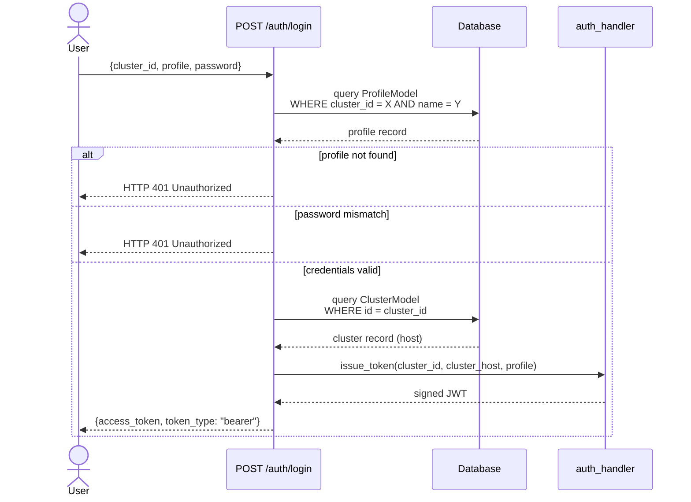
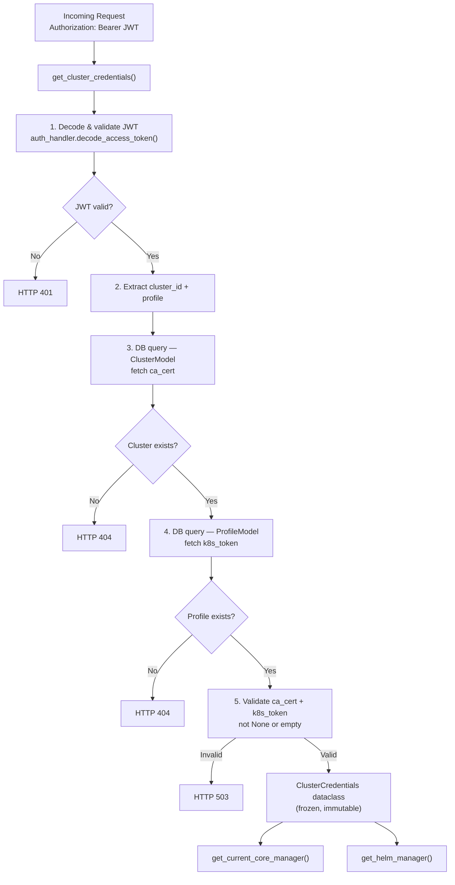
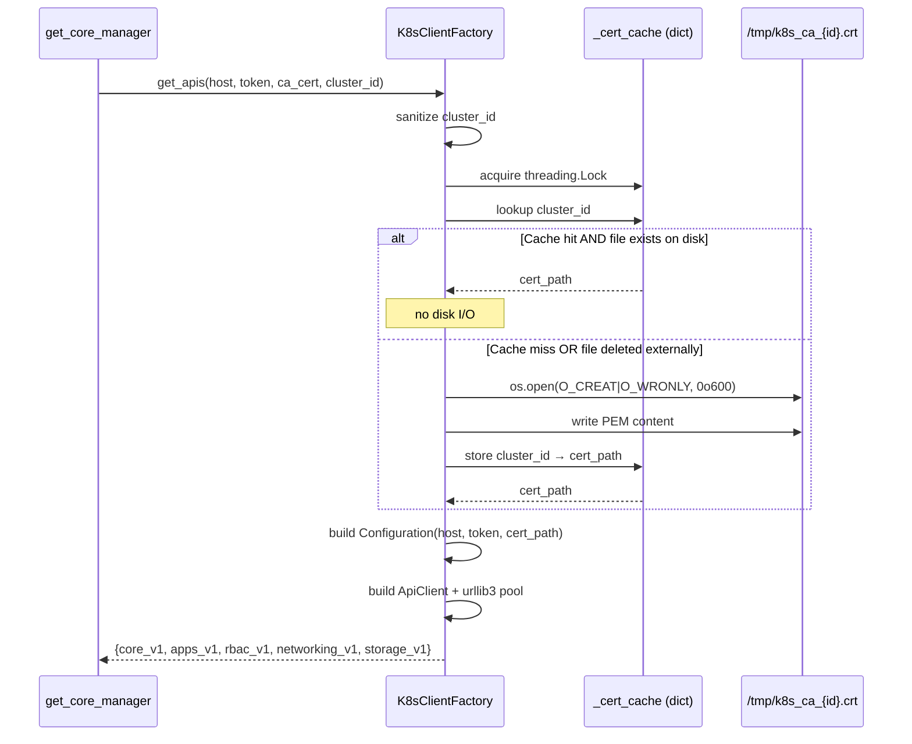
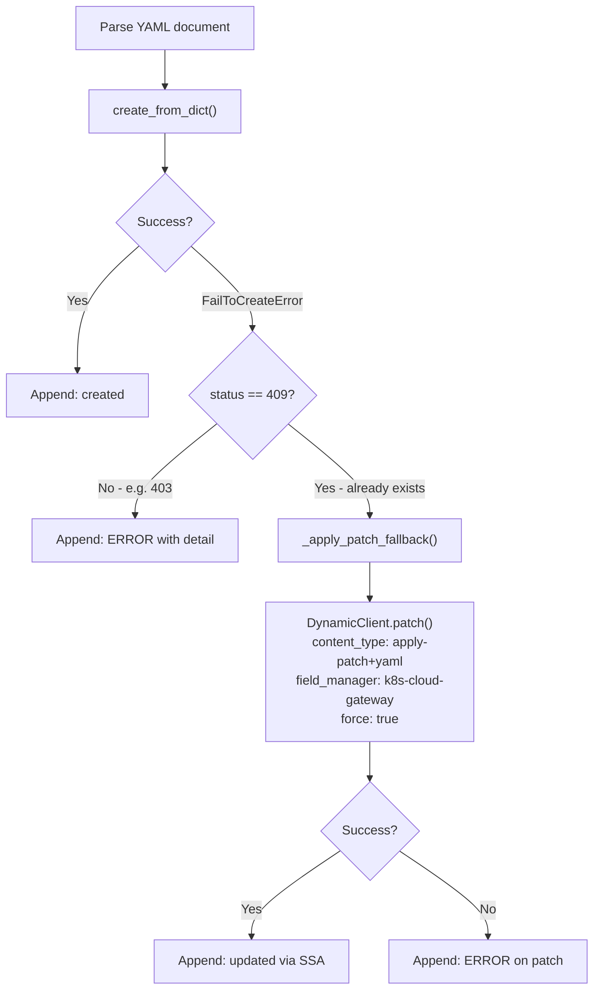
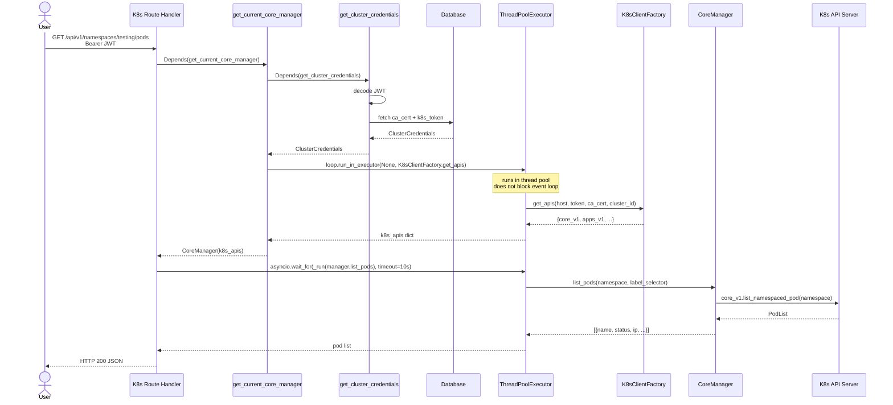
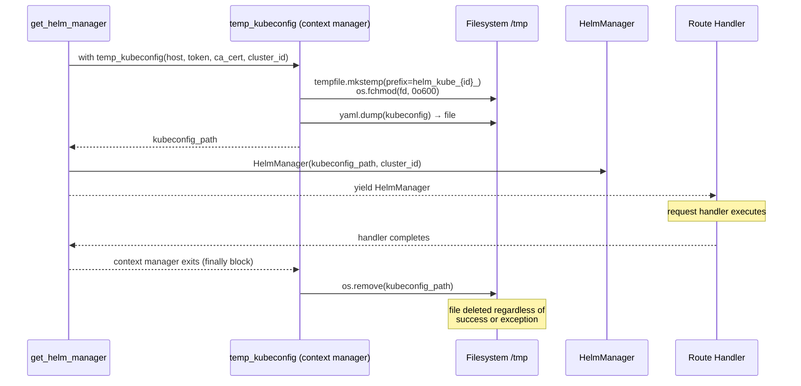
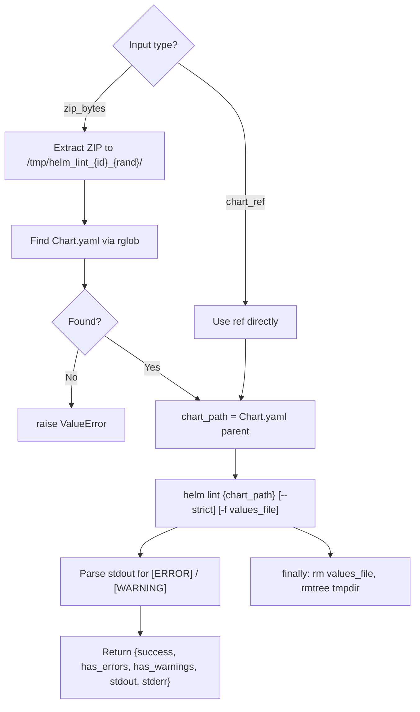
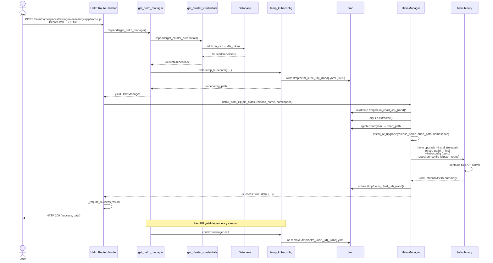
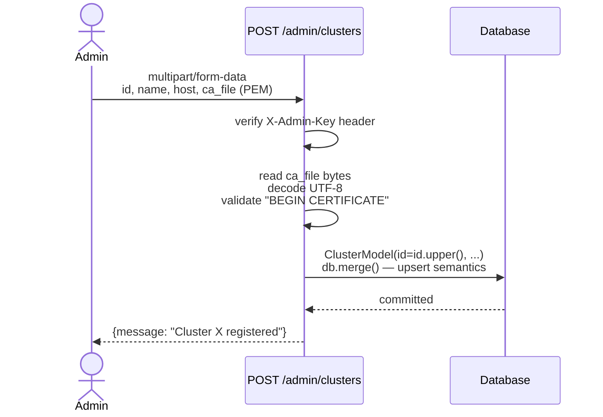
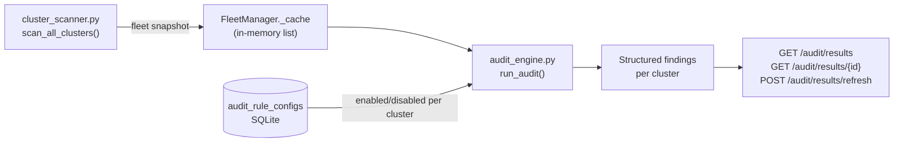

# Backend — Internal Architecture & Developer Guide

> Detailed documentation of the gateway's internal processes, request lifecycle, security strategies, and component responsibilities.

---

## Table of Contents

1. [Stack & Dependencies](#1-stack--dependencies)
2. [Application Bootstrap](#2-application-bootstrap)
3. [Database Model](#3-database-model)
4. [Authentication System](#4-authentication-system)
5. [Shared Credential Pipeline](#5-shared-credential-pipeline)
6. [K8s Client Factory & Certificate Cache](#6-k8s-client-factory--certificate-cache)
7. [CoreManager — K8s Operations](#7-coremanager--k8s-operations)
8. [K8s Request Lifecycle — End to End](#8-k8s-request-lifecycle--end-to-end)
9. [HelmManager — Helm Operations](#9-helmmanager--helm-operations)
10. [Helm Request Lifecycle — End to End](#10-helm-request-lifecycle--end-to-end)
11. [Timeout & Concurrency Strategy](#11-timeout--concurrency-strategy)
12. [Error Propagation](#12-error-propagation)
13. [Admin API](#13-admin-api)
14. [Compliance Audit System](#14-compliance-audit-system)
15. [Security Design Decisions](#15-security-design-decisions)

---

## 1. Stack & Dependencies

| Package | Role |
|---|---|
| `fastapi` | ASGI web framework, dependency injection, request routing |
| `uvicorn` | ASGI server |
| `pyjwt` | JWT issue and decode |
| `kubernetes` | Official Python client for the K8s API |
| `sqlalchemy` | ORM for the SQLite cluster/profile registry |
| `pyyaml` | YAML parsing for universal apply and Helm values files |
| `urllib3` | HTTP connection pool (transitive via `kubernetes`) |
| `python-multipart` | `multipart/form-data` support for file uploads |
| `cryptography` | Fernet symmetric encryption for sensitive database columns |

Helm operations use the `helm` binary installed in the container image — no Python Helm library. The binary is invoked via `asyncio.create_subprocess_exec`.

---

## 2. Application Bootstrap

```
app/
├── main.py              ← FastAPI app instance, lifespan, router registration
└── api/
    └── api_server.py    ← Router aggregation, CORS, middleware
```

`main.py` creates the FastAPI application and registers four routers:

```python
app.include_router(auth_router,  prefix="/api/v1/auth",  tags=["auth"])
app.include_router(k8s_router,   prefix="/api/v1",       tags=["k8s"])
app.include_router(helm_router,  prefix="/api/v1/helm",  tags=["helm"])
app.include_router(admin_router, prefix="/api/v1/admin", tags=["admin"])
app.include_router(admin_router, prefix="/api/v1/admin/audit", tags=["audit"])
```

All K8s and Helm routes go through FastAPI's dependency injection system. No middleware intercepts requests globally — authentication is enforced per-route via `Depends`.

---

## 3. Database Model

The gateway uses **SQLite** via SQLAlchemy. The database is auto-created on first run at the path defined by `DATABASE_URL`.

```mermaid
ClusterDiagram
    CLUSTER {
        string id PK
        string name
        string host
        text   ca_cert
    }
    PROFILE {
        int    id PK
        string cluster_id FK
        string name
        string gateway_password
        string k8s_token
    }
    CLUSTER ||--o{ PROFILE : "has"
```

**`ClusterModel`** stores the API server host and the PEM CA certificate. The CA cert is stored encrypted in the database and written to disk as a temporary file only when needed by the K8s client (see [Section 6](#6-k8s-client-factory--certificate-cache)).

**`ProfileModel`** maps a human-readable profile name and a gateway password to a Kubernetes Service Account token. The gateway password is the credential users type at login — it is not the SA token. This decoupling means rotating a SA token only requires updating `k8s_token` in the database, with no user-facing credential change.

### At-rest encryption

The three most sensitive fields are encrypted in the SQLite database using **Fernet** symmetric encryption (`cryptography` package):

| Field | Model | Sensitivity |
|---|---|---|
| `gateway_password` | `ProfileModel` | Gateway login credential |
| `k8s_token` | `ProfileModel` | Direct K8s API access |
| `ca_cert` | `ClusterModel` | Cluster topology + TLS trust anchor |

Encryption is implemented via `EncryptedString`, a SQLAlchemy `TypeDecorator` in `app/infrastructure/database.py`. It intercepts every `INSERT`/`UPDATE` to encrypt before writing, and every `SELECT` to decrypt after reading. The rest of the application — `registry.py`, `auth_handler.py`, `admin_routes.py` — works with plaintext strings and is unaware of the encryption layer.

**Fernet** (AES-128-CBC + HMAC-SHA256) was chosen over hashing because `gateway_password` must be recovered in plaintext for the `secrets.compare_digest` comparison in `auth_handler.py`. Hashing is one-way and would require rewriting the authentication flow. For credentials that need to be used as-is (API tokens, passwords passed to external systems), authenticated symmetric encryption is the correct primitive.

The encryption key is read from `ENCRYPTION_KEY` in `.env` at startup. If the variable is missing or the key is malformed, the process refuses to start with an explicit error message.

```
app/infrastructure/
├── encryption.py     ← Fernet key loading, encrypt(), decrypt()
└── database.py       ← EncryptedString TypeDecorator, models
```

---

## 4. Authentication System

```
app/api/auth/
├── auth_routes.py    ← POST /auth/login
└── auth_handler.py   ← create_access_token(), decode_access_token()
```

### Login Flow



### JWT Structure

The token is signed with `HS256` using `JWT_SECRET_KEY`. It contains:

```json
{
  "cluster_id":   "MY-CLUSTER",
  "cluster_host": "https://10.0.0.1:6443",
  "profile":      "dev",
  "jti":          "uuid4",
  "exp":          1234567890
}
```

**What is deliberately absent:** `k8s_token`, `ca_cert`, `gateway_password`. The JWT payload is base64-encoded, not encrypted — anyone holding the token can decode the payload. Excluding Kubernetes credentials from the payload is therefore a hard security requirement, not an optimisation.

### Token Expiry & Revocation

Tokens expire after `ACCESS_TOKEN_EXPIRE_MINUTES` (default: 60 minutes). There is no refresh token mechanism — users re-authenticate at expiry.

Immediate revocation without token expiry is possible by rotating the `k8s_token` in the database. On the next request, the gateway will fetch the new (or invalidated) token from the DB and the K8s API server will reject it, effectively revoking access even for a still-valid JWT.

---

## 5. Shared Credential Pipeline

```
app/api/dependencies/
├── get_cluster_credentials.py  ← shared base dependency
├── get_core_manager.py         ← K8s dependency
└── get_helm_manager.py         ← Helm dependency
```

Every protected route — both K8s and Helm — resolves credentials through a common pipeline. This ensures a single source of truth for JWT validation and database access, with no duplication between the two route families.



### `ClusterCredentials` dataclass

```python
@dataclass(frozen=True)
class ClusterCredentials:
    cluster_id:   str
    cluster_host: str
    profile:      str
    k8s_token:    str   # never logged
    ca_cert:      str
```

`frozen=True` prevents any accidental mutation downstream. FastAPI caches the dependency result within a single request scope — if both a K8s route and a sub-dependency call `get_cluster_credentials`, the DB is queried only once per request.

---

## 6. K8s Client Factory & Certificate Cache

```
app/infrastructure/k8s_factory.py
```

`K8sClientFactory` is a pure static class responsible for building authenticated `kubernetes.ApiClient` instances. It is called once per request from `get_current_core_manager`.

### Responsibilities

- Validate that a PEM CA certificate is present (no silent fallback to `verify_ssl=False`)
- Write the CA certificate to disk with `0600` permissions using `os.open` (atomic creation, no chmod race)
- Cache the cert file path per `cluster_id` to avoid redundant disk writes across requests
- Configure urllib3 connection pool with explicit connect and read timeouts
- Return a dict of typed API client objects: `core_v1`, `apps_v1`, `rbac_v1`, `networking_v1`, `storage_v1`

### Certificate Cache



**Why disk instead of in-memory?** The `kubernetes` Python SDK accepts CA certs only as file paths — there is no API to pass a PEM string directly. The file is written once per cluster and reused by all subsequent requests. If `/tmp` is cleared (e.g. container restart), the cache miss path recreates the file automatically.

**Thread safety:** The cache dict and the check-then-write sequence are protected by a `threading.Lock`. The K8s factory runs in a thread pool executor (see [Section 11](#11-timeout--concurrency-strategy)), so concurrent requests for the same cluster on startup are safe.

### Network Policy

Three timeout layers work together to prevent hanging requests:

```
socket.setdefaulttimeout(15s)          ← TCP level: handles silent packet drop (host down)
urllib3 Timeout(connect=5, read=15)    ← HTTP level: handles slow responses
asyncio.wait_for(timeout=10s)          ← App level: releases event loop, returns 504
```

The asyncio timeout (10s) fires before the socket timeout (15s), ensuring the event loop is freed and a clean `504 Gateway Timeout` is returned to the frontend before the underlying thread times out on its own.

---

## 7. CoreManager — K8s Operations

```
app/core/core_manager.py
```

`CoreManager` is a thin, typed wrapper around the `kubernetes` SDK clients. It receives the pre-built API clients from `K8sClientFactory` and exposes them as domain-specific methods.

### Capabilities

| Category | Methods |
|---|---|
| Cluster | `check_connectivity`, `list_nodes` |
| Namespaces | `list_namespaces`, `create_namespace`, `delete_namespace` |
| Workloads | `list_pods`, `get_pod_by_name`, `get_pod_logs`, `list_deployments`, `get_deployment_by_name`, `scale_deployment`, `restart_deployment`, `delete_deployment`, `list_namespaced_stateful_sets`, `delete_namespaced_stateful_set` |
| Networking | `list_services_in_namespace`, `get_service_by_name`, `list_ingress`, `delete_ingress` |
| Config | `list_configmaps`, `list_secrets`, `list_events` |
| RBAC | `list_service_accounts`, `list_roles`, `list_role_bindings` and their delete counterparts |
| Storage | `list_persistent_volumes`, `list_namespaced_pvc`, `delete_namespaced_pvc`, `list_storage_classes`, `delete_storage_class` |
| Apply | `apply_universal_yaml` — multi-resource YAML apply with SSA fallback |

### Universal Apply Strategy

`apply_universal_yaml` handles multi-document YAML manifests without requiring the caller to specify a namespace. For each document:



The fallback uses **Server-Side Apply** — the same mechanism as `kubectl apply`. The `field_manager` tag `k8s-cloud-gateway` lets Kubernetes track which fields the gateway owns, enabling clean updates without overwriting fields managed by other controllers.

### Exception Handling

All SDK calls are wrapped in `_handle_exception`, which translates K8s API errors into a consistent exception hierarchy:

```
K8sBaseException (500)
├── K8sResourceNotFoundException (404)  — e.status == 404
├── K8sUnauthorisedException (401/403)  — e.status in [401, 403]
└── K8sCommunicationException (504)     — network timeout / connection refused
```

FastAPI's exception handlers map these to the correct HTTP status codes before the response reaches the client.

---

## 8. K8s Request Lifecycle — End to End



**Why `run_in_executor` for the factory?** `K8sClientFactory.get_apis` is synchronous: it acquires a lock, potentially writes a file to disk, and allocates a urllib3 connection pool. Blocking the asyncio event loop with this work would prevent the gateway from handling other requests during that time. The executor offloads it to a thread while the event loop stays free.

**Why `run_in_executor` for CoreManager calls too?** The `kubernetes` SDK is fully synchronous. Every method call blocks its thread until the K8s API server responds. The dedicated `ThreadPoolExecutor` (20 workers) absorbs these blocking calls. `asyncio.wait_for` caps the wait at 10 seconds per operation, ensuring the event loop is never held indefinitely even if a cluster goes offline mid-request.

---

## 9. HelmManager — Helm Operations

```
app/core/helm_manager.py
app/infrastructure/helm_kubeconfig.py
```

### Subprocess Architecture

All Helm operations are executed by spawning `helm` as a child process via `asyncio.create_subprocess_exec`. This approach was chosen deliberately over Python Helm libraries because:

- `pyhelm` supports only Helm 2 (EOL since 2020)
- `pyhelm3` is an unofficial, unmaintained subprocess wrapper with no stability guarantees
- The CLI approach guarantees compatibility with all Helm 3.x versions and access to every CLI feature

Every `_run()` call always injects three arguments before the user-supplied command:

```
helm --kubeconfig {temp_path} --repository-config {cluster_repo_config} --repository-cache {cluster_cache} {args...}
```

This ensures:
1. The correct cluster credentials are used (kubeconfig)
2. Repository state is isolated per cluster (repository-config, repository-cache)

### Per-Cluster Repository Isolation

```
/tmp/helm_repos/
  CLUSTER-A/
    repositories.yaml    ← repos added by any user of cluster A
    cache/               ← index files downloaded by helm repo update
  CLUSTER-B/
    repositories.yaml
    cache/
```

The directory tree is created by `HelmManager.__init__` on first instantiation for each cluster. An empty `repositories.yaml` is written if none exists, because `helm repo list` fails without the file being present.

This volume is mounted persistently in Docker Compose so repository configuration survives container restarts.

### Temporary Kubeconfig Lifecycle



The kubeconfig is created with `tempfile.mkstemp` — which sets `O_CREAT | O_EXCL` atomically, preventing filename collisions under concurrent requests for the same cluster. Permissions are set via `fchmod` on the open file descriptor, eliminating the window between creation and `chmod` that would exist with `open()` + `os.chmod()`.

### `_run()` Result Schema

Every Helm subprocess call returns a consistent dict regardless of success or failure:

```python
{
    "success":    bool,         # returncode == 0
    "returncode": int,          # raw exit code
    "stdout":     str,          # stripped stdout
    "stderr":     str,          # stripped stderr
    "data":       list | dict | None,  # parsed JSON if parse_json=True
    "command":    str           # readable command string, no kubeconfig path
}
```

The `command` field logs the human-readable command without the kubeconfig path (which contains the cluster ID and a temp path, but not the token).

### Timeout Tiers

| Operation type | Timeout | Rationale |
|---|---|---|
| `list`, `status`, `history`, `search`, `show` | 30s | Read-only, fast network ops |
| `repo add`, `repo update` | 60s | Network-dependent, index download |
| `install`, `upgrade`, `uninstall` | 120s | Cluster write operations |
| `install/upgrade --wait` or `--atomic` | 300s | Waits for pod readiness |

### Lint Strategy

`helm lint` validates a chart's syntax and template rendering without deploying anything. The gateway supports linting both from a repository reference and from a ZIP upload:



`helm lint` exits with `rc=1` on errors and `rc=0` on warnings-only. The gateway normalises this into explicit `has_errors` and `has_warnings` booleans so the frontend can distinguish and present them clearly without parsing stdout itself.

---

## 10. Helm Request Lifecycle — End to End



---

## 11. Timeout & Concurrency Strategy

### K8s Routes

K8s routes use a **dedicated `ThreadPoolExecutor`** with 20 workers:

```python
k8s_executor = ThreadPoolExecutor(max_workers=20, thread_name_prefix="k8s_worker")
```

Every K8s operation is dispatched through:

```python
await asyncio.wait_for(
    loop.run_in_executor(k8s_executor, partial(fn, *args)),
    timeout=10.0
)
```

The 10-second hard timeout fires before the 15-second socket timeout. When it fires:
- `asyncio.wait_for` raises `TimeoutError` immediately
- The event loop is freed — other requests continue normally
- The thread in the pool remains blocked until the socket times out (~15s), then exits cleanly
- The client receives `HTTP 504 Gateway Timeout`

This design avoids the alternative (blocking the event loop) which would make the entire gateway unresponsive during a cluster outage.

### Helm Routes

Helm operations are `async` (via `asyncio.create_subprocess_exec`) and do not block the event loop. Timeouts are applied at the subprocess level via `asyncio.wait_for(proc.communicate(), timeout=...)`. On timeout, `proc.kill()` sends SIGKILL to the helm process before re-raising.

### Concurrency Matrix

| Scenario | Behaviour |
|---|---|
| 5 simultaneous requests to cluster A | 5 threads from pool, parallel |
| 20 simultaneous requests (pool full) | 21st request waits for a free thread |
| Cluster A offline, request to cluster B | Thread for A is blocked but B proceeds normally |
| Helm `--wait` on cluster A (300s timeout) | Subprocess waits, event loop free, other requests unaffected |
| JWT invalid | Rejected in dependency before any thread is allocated |

---

## 12. Error Propagation

### K8s Error Chain

```
K8s API Server (HTTP 403)
  → kubernetes SDK raises ApiException(status=403)
    → CoreManager._handle_exception()
      → raises K8sUnauthorisedException(status_code=403)
        → FastAPI exception handler
          → HTTP 403 to client
            → apiCall() in frontend: throw Error("RESTRICTED")
              → renderRestrictedAccess() renders the access-denied UI
```

### Helm Error Chain

```
helm binary (rc=1, stderr="secrets is forbidden: ...")
  → HelmManager._run() returns {success: False, stderr: "..."}
    → helm_routes._require_success()
      → "forbidden" in stderr → raises HTTPException(403)
        → HTTP 403 to client
          → apiCall(): throw Error("RESTRICTED")
            → renderRestrictedAccess()
```

```
helm binary (rc=1, stderr="release not found")
  → HelmManager._run() returns {success: False, stderr: "..."}
    → helm_routes._require_success()
      → not forbidden → raises HTTPException(400)
        → HTTP 400 to client
          → apiCall(): throw Error("release not found")
            → showError() renders alert with message
```

**The contract:** routes never return `HTTP 200` with `success: false` in the body. A failed Helm command always results in a non-2xx HTTP status. This eliminates the failure mode where the frontend silently renders an empty list instead of reporting an error.

---

## 13. Admin API

```
app/api/routes/admin_routes.py
```

Protected by the `X-Admin-Key` header, verified against `ADMIN_MASTER_KEY` in `.env`. This key is checked on every request via a FastAPI dependency — no session or token is issued.

### Cluster Registration Flow



`db.merge()` gives the registration endpoint **upsert semantics** — registering the same cluster ID twice updates the existing record rather than raising a conflict error. This is intentional: re-registration is the update mechanism for the host URL or CA certificate.

Deleting a cluster cascades to all associated profiles via the database foreign key relationship.

### Profile Token Preview

`GET /admin/profiles` returns only `token_preview: "eyJhbGci..."` — the first 10 characters followed by `...`. The full SA token is never returned by any API endpoint, even to the admin.

---

## 14. Compliance Audit System

```
app/core/audit_engine.py
app/api/routes/audit_routes.py
app/infrastructure/database.py   ← AuditRuleConfig model
app/infrastructure/cluster_scanner.py  ← data source
```

The audit system is a lightweight compliance engine that evaluates policy rules against cluster snapshots collected by the Fleet Observer. It is entirely read-side at evaluation time: no additional K8s API calls are made when the audit runs — it operates on data already present in the `FleetManager` cache.

### Data Flow



### Rule Registry

Rules are defined as `AuditRule` dataclass instances registered in `RULE_REGISTRY` — a plain Python dict keyed by rule ID. Adding a new rule requires no database migration:

```python
# 1. Write an evaluate function
def _eval_my_rule(cluster: dict) -> AuditFinding:
    ...
    return AuditFinding(passed=True, detail="All good.")

# 2. Register the rule
AuditRule(
    id="my-rule",
    name="My Rule",
    description="What this checks and why it matters.",
    severity="warning",          # critical | warning | info
    needs={"nodes"},             # which snapshot keys this rule reads
    evaluate=_eval_my_rule,
)
```

The `needs` field is metadata for the scanner: it declares which cluster snapshot keys the rule depends on. As the scanner is extended to collect more data (e.g. RBAC bindings, pod security contexts), `needs` allows the system to fetch only what the active rules for a given cluster actually require.

### Per-Cluster Configuration & Default-On Logic

The `audit_rule_configs` table stores explicit overrides only. The engine's resolution logic is:

```
rule_id in DB for this cluster AND enabled=False  →  rule is DISABLED
rule_id not in DB for this cluster                →  rule is ENABLED (default-on)
rule_id in DB for this cluster AND enabled=True   →  rule is ENABLED
```

This means a freshly registered cluster automatically receives the full audit suite with zero configuration. An admin only needs to interact with the DB to *disable* something, not to enable it.

### Offline Cluster Handling

Clusters in `status=offline` receive only the `cluster-reachable` rule. All other rules are skipped. This prevents a flood of false-positive failures (e.g. `all-nodes-ready` failing because there are no nodes to check) when a cluster is simply unreachable. The finding for `cluster-reachable` carries the original connection error as `detail` and `evidence`.

### Audit Result Schema

```python
{
    "cluster_id":   str,
    "cluster_name": str,
    "status":       str,          # "online" | "offline" | "degraded"
    "score":        int,          # number of rules passed
    "total":        int,          # number of rules evaluated
    "score_pct":    float,        # passed / total * 100
    "findings": [
        {
            "rule_id":   str,
            "rule_name": str,
            "severity":  str,     # "critical" | "warning" | "info"
            "passed":    bool,
            "detail":    str,     # human-readable result description
            "evidence":  dict,    # structured data for UI drill-down
        }
    ]
}
```

The `evidence` dict is rule-specific. Examples:

| Rule | Evidence keys |
|---|---|
| `all-nodes-ready` | `not_ready_nodes: list[str]`, `total_nodes: int` |
| `k8s-version-policy` | `outdated_nodes: list[{node, version}]`, `min_required: str` |
| `pod-health-ratio` | `pods_running: int`, `pods_total: int`, `ratio_pct: float` |
| `os-homogeneity` | `os_distribution: dict[node_name, os]` |

### Summary Aggregation

`GET /audit/results` and `POST /audit/results/refresh` include a top-level `summary` object computed by `_build_summary()` in `audit_routes.py`:

```python
{
    "total_clusters":    int,   # clusters evaluated
    "fully_compliant":   int,   # clusters where score == total
    "total_findings":    int,   # sum of all evaluated rules across fleet
    "passed_findings":   int,
    "failed_findings":   int,
    "critical_failures": int,   # failed findings with severity == "critical"
    "avg_score_pct":     float  # fleet-wide compliance percentage
}
```

This is used by the Admin Console frontend to populate the summary cards at the top of the Audit Results page.

---

## 15. Security Design Decisions

### Why no k8s_token in the JWT?

The JWT payload is base64-encoded, not encrypted. Anyone with the token — obtained via XSS on `localStorage`, network interception, or physical browser access — can decode the payload. Including the SA token in the payload would expose direct cluster access credentials to any attacker who steals a JWT.

By keeping only `cluster_id` and `profile` in the JWT, a stolen token can only be used through the gateway, which enforces its own authentication and rate limiting. The attacker cannot use the token to talk directly to the Kubernetes API server.

### Why CA cert on disk and not in-memory?

The `kubernetes` Python SDK only accepts CA certificates as file paths — there is no constructor parameter for PEM string content. Writing to disk is unavoidable. The implementation minimises exposure by:

- Writing once per cluster per container lifecycle (cached after first write)
- Using `os.open` with `O_CREAT | O_WRONLY` and mode `0600` atomically
- Never logging the file path in a way that exposes cluster topology

### Why subprocess for Helm instead of a Python library?

No Python library provides full Helm 3 support with maintenance guarantees. `pyhelm` is Helm 2 only. `pyhelm3` is an unofficial wrapper around subprocess with an unstable API. Using the `helm` binary directly:

- Works with every Helm 3.x version
- Supports every CLI feature (including future additions)
- Produces identical behaviour to manual `helm` usage
- Requires only that `helm` is present in the container image

### Why temporary kubeconfig instead of env vars?

Helm reads credentials from a kubeconfig file. Passing credentials via environment variables (`KUBECONFIG` pointing to a shared file) creates race conditions in a multi-tenant gateway where concurrent requests for different clusters would overwrite each other's `KUBECONFIG`. Temporary per-request kubeconfig files, created with `mkstemp` (atomic, unique names), eliminate this race entirely.

### Why `--repository-config` per cluster instead of shared?

Helm's default `repositories.yaml` at `~/.config/helm/repositories.yaml` is a single file. In a multi-cluster gateway, a repository added by a user of Cluster A would be immediately visible to users of Cluster B. Passing `--repository-config /tmp/helm_repos/{cluster_id}/repositories.yaml` gives each cluster its own isolated repository namespace at the cost of one additional CLI flag per subprocess invocation.

